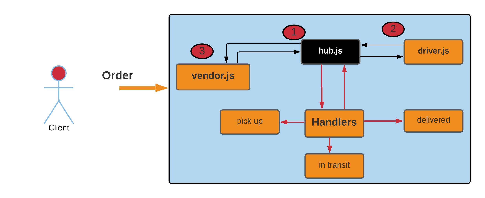

# Code-Academy-Parcel-Service--CAPS-

- A system that emulates a real world supply chain. CAPS will simulate a delivery service where vendors (such a flower shops) will ship products using our delivery service and when our drivers deliver them, be notified that their customers received what they purchased.

---

## Notes (if you want to use this app) ❗:

1. Fork the repo and clone it.
2. `npm i` to install the dependencies
3. TO RUN on console:

- `node hub.js`
- `node driver.js`
- `node vendor.js`

4. `TO TEST => npm test`

---

## UML

---

## Example of an output for an oreder:

---

## Links

[GitHub actions](https://github.com/Wesam-Alqawasmeh/Code-Academy-Parcel-Service--CAPS-/actions)

[Pull request](https://github.com/Wesam-Alqawasmeh/Code-Academy-Parcel-Service--CAPS-/pull/1)
